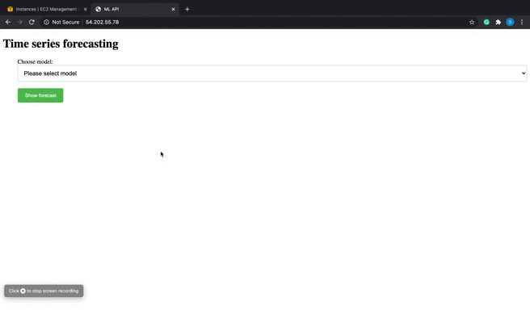

# Time-Series-Forecasting-on-Web-Traffic-Dataset

Performed time-series analysis and forecasting on Google's web traffic dataset to forecast number of views of Wikipedia web pages. This can help Google take effective measures to handle the web traffic.

**Dataset:** Kaggle Web Traffic Time Series Forecasting (https://www.kaggle.com/c/web-traffic-time-series-forecasting)

**Technologies and libraries used:** Python, AWS EC2, AWS S3, Flask, Statsmodels, Prophet, Tensorflow, Matplotlib.



## Key highlights
- Performed time series analysis, anomaly detection using `Isolation Forest` and interpolation using `rolling mean`
- Explored various time series forecasting models including ARMA, ARIMA, Exponential Smoothing, Prophet, Auto-arima, CNN and LSTM and compared performance using `RMSE`
- Developed `flask` app to render forecast plots generated using saved models
- Practiced fetching data from `AWS S3` using boto3 and deployed the flask app on `AWS EC2` instance using nginx and gunicorn

## Execution

Use requirements.txt file to install the dependancies.

  ```
  pip install -r req.txt
  ```
  
To run the application on local system, comment lines 19-23 in app.py and uncomment line 25. Enter the following command in terminal.
  ```
  python app.py
  ```

## Time series analysis, anomaly detection and forecasting

To view various analysis on the web traffic time series data, steps taken to detect and handle anomalies, model training, testing and forecasting, view the following Jupyter notebooks:

  - [forecast.ipynb](forecast.ipynb)
  - [forecast_CNN.ipynb](forecast_CNN.ipynb)
  - [forecast_LSTM.ipynb](forecast_LSTM.ipynb)


## Model performance

Model  | RMSE
------------- | -------------
ARMA  | 1.732618
ARIMA  | 1.734711
Auto-arima  | 2.148956
Exponential Smoothing  | 2.186610
Prophet  | 3.525529
